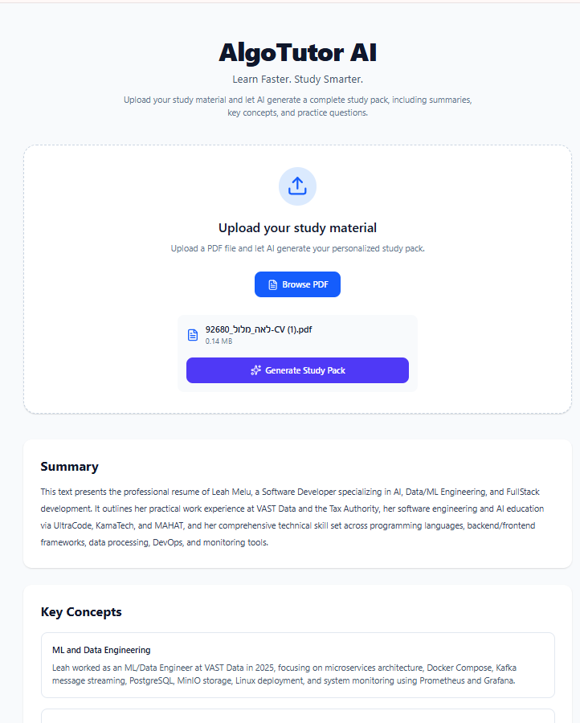

# AlgoTutor AI

> AI-powered learning assistant that transforms PDF study material into structured study packs using Large Language Models.


---

## Overview

AlgoTutor AI is an AI-powered study assistant that transforms PDF study material into structured learning resources.

Users upload a PDF document, and the application extracts its content, sends it to an LLM, and generates a complete study pack.

Each study pack contains:

- 📄 Summary
- 🧠 Key Concepts
- ❓ Practice Questions

---

## Features

- Upload PDF study material
- Automatic PDF text extraction
- AI-powered study pack generation
- Modern React frontend
- FastAPI REST API
- Modular and scalable architecture
- Type-safe frontend and backend models

---

## Preview



---

## Architecture

```text
                +-------------+
                |   React UI  |
                +------+------+
                       |
                       v
                Study API Client
                       |
                       v
                  FastAPI Router
                       |
                       v
                 Study Service
                  /          \
                 /            \
                v              v
        PDF Service      AI Service
                 \            /
                  \          /
                   v        v
                  Study Pack
```

---

## Project Structure

```text
algo-tutor-ai
│
├── backend
│   ├── app
│   │   ├── api
│   │   ├── core
│   │   ├── models
│   │   └── services
│   │
│   ├── requirements.txt
│   └── .env.example
│
├── frontend
│   ├── src
│   │   ├── api
│   │   ├── components
│   │   ├── hooks
│   │   ├── pages
│   │   └── types
│   │
│   └── .env.example
│
├── docs
│   └── images
│
├── LICENSE
└── README.md
```

---

## Tech Stack

### Backend

- Python
- FastAPI
- Pydantic

### Frontend

- React
- TypeScript
- Vite
- Tailwind CSS

### AI

- Gemini API

---

## Quick Start

### Backend

```bash
cd backend

python -m venv .venv

pip install -r requirements.txt

uvicorn app.main:app --reload
```

### Frontend

```bash
cd frontend

npm install

npm run dev
```

---

## Environment Variables

### Backend

Create a `.env` file inside the `backend` directory.

```env
GEMINI_API_KEY=your_api_key_here
FRONTEND_URL=http://localhost:5173
```

### Frontend

Create a `.env` file inside the `frontend` directory.

```env
VITE_API_URL=http://localhost:8000
```

---

## API Documentation

After starting the backend:

```text
http://localhost:8000/docs
```

---

## Docker

Docker support is currently in progress.

A complete Docker Compose setup for both the frontend and backend will be added soon.

---

## Roadmap

- Authentication
- User accounts
- Study history
- Flashcards
- Multiple document formats
- Export study packs
- Dark mode

---

## License

This project is licensed under the MIT License.

See the `LICENSE` file for more information.